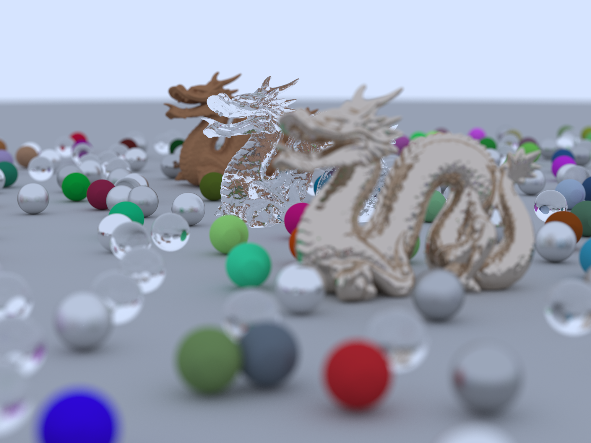
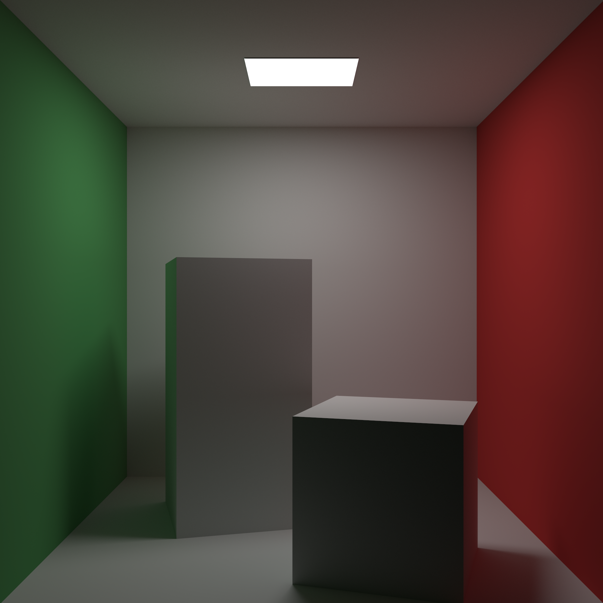
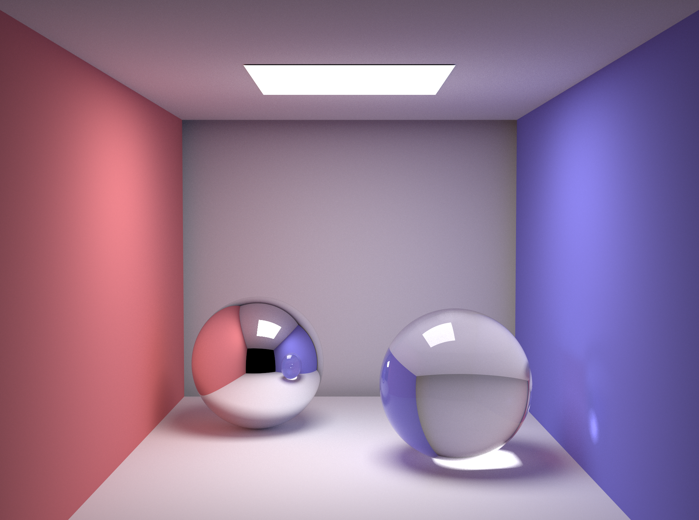

# rust ray tracer

[](https://github.com/w3ntao/rust-ray-tracer/actions/workflows/build-and-test.yml)


A rust ray tracer inspired by [Ray Tracing in One Weekend Series](https://raytracing.github.io/)

## build and run

download stanford dragon model:
```
$ cd rust-ray-tracer
$ wget 'https://casual-effects.com/g3d/data10/research/model/dragon/dragon.zip'
$ mkdir models
$ unzip dragon.zip -d models/
```

run:
```
$ cargo run --release
```

## rendering samples
Ray Tracing In One Weekend final scene with dragon (2000x1500, 1936 samples per pixel):


Cornell box (2000x2000, 1936 samples per pixel):


Cornell box with specular material (2000x2000, 1936 samples per pixel):


Cornell box with metal dragon (2000x2000, 1936 samples per pixel):


smallpt scene from [Kevin Beason](https://www.kevinbeason.com/smallpt/) (2048x1524, 1936 samples per pixel):

